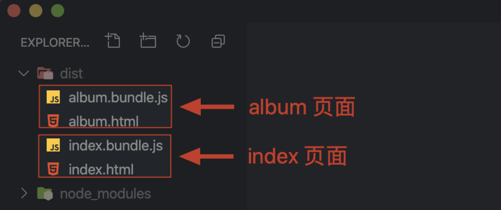

## All in One的弊端

通过webpack实现前端项目整体模块化优势固然明显，但也存在一些问题，他最终将所有的代码都打包在一起<br>
如果应用非常复杂，模块非常多，这种all in one的方式就会导致打包的结果非常大，甚至超过5M，应用响应速度会受到很大影响
所以这种**all in one的方式并不合理**

更为合理的方式是打包结果按照一定得规则分离到多个bundle中，然后根据应用的需要<span style="color: red;">**按需加载，降低启动成本，提高响应速度**</span><br>

Q：但是webpack的功能是将散落的模块打包在一起，提高效率，但是这里又要将打包模块拆开，这是否矛盾呢？<br>
A：web应用受到资源环境所限，<span style="color: red;">太大不行，太碎也不行</span><br>

因为在开发过程中，划分功能模块的颗粒度会非常细，一个功能模块通常只提供了一个小的工具函数，不能形成一个功能单元，如果不将这些模块打包在一起，而是按照开发时的模块划分，那么去运行一个小功能，就需要<div color="red">加载非常多的资源模块</div>

目前主流的HTTP1.1协议本身是有缺陷的，例如：
- 同一个域名下的并行请求是有限制的
- 每次请求都有一定得延时
- 每次请求除了传输内容，还有请求头，大量请求的情况下，这些请求头加在一起就造成了流量和带宽的浪费<br>

综上所述，模块的打包是必须的。但是当应用模块体积越来越大时，也要适当的拆分<br>

## code splitting通过把项目中的资源按照我们设计的规则打包到不同的bundle中，降低应用的启动成本，提高响应速度

### 目前webpack实现分包的方式主要有两种
1. 根据业务不同配置多个打包入口，输出多个打包结果
2. 结合ES Module的动态导入（Dynamic Imports）特性，按需加载模块

## 多入口打包的方式
- 多入口打包一般用于传统多页应用程序，最常见的划分规则就是一个页面对应一个打包入口，对于不同页面公共部分提取到公共的结果中
```
// 文件结构
├── dist
├── src
│   ├── common
│   │   ├── fetch.js
│   │   └── global.css
│   ├── album.css
│   ├── album.html
│   ├── album.js
│   ├── index.css
│   ├── index.html
│   └── index.js
├── package.json
└── webpack.config.js

```
- webpack.config.js配置
```javaScript
const HtmlWebpackPlugin = require('html-webpack-plugin')
module.exports = {
    mode: 'none',
    entry: {
        index: './src/index.js',
        album: './src/album.js'
    },
    output: {
        filename: '[name].bundle.js'
    },
    module: {
        rules: [
            {
                test: /\.css$/,
                use: [
                'style-loader',
                'css-loader'
                ]
            }
        ]
    },
    plugins: [
        new HtmlWebpackPlugin({
            title: 'Multi Entry',
            template: './src/index.html',
            filename: 'index.html',
            chunks: ['index']
        }),
        new HtmlWebpackPlugin({
            title: 'Multi Entry',
            template: './src/album.html',
            filename: 'album.html',
            chunks: ['album']
        })
    ]
}
```
- 这个示例中有两个页面，分别是 index 和 album。代码组织的逻辑也很简单：
index.js 负责实现 index 页面功能逻辑；
album.js 负责实现 album 页面功能逻辑；
global.css 是公用的样式文件；
fetch.js 是一个公用的模块，负责请求 API。

- 一般 entry 属性中只会配置一个打包入口，如果我们需要配置多个入口，可以把 entry 定义成一个对象。
> **注意：这里 entry 是定义为对象而不是数组，如果是数组的话就是把多个文件打包到一起，还是一个入口。**
- 在这个对象中一个属性就是一个入口，属性名称就是这个入口的名称，值就是这个入口对应的文件路径。那我们这里配置的就是 index 和 album 页面所对应的 JS 文件路径。
- 在配置中还通过 html-webpack-plugin 分别为 index 和 album 页面生成了对应的 HTML 文件。
- 完成配置之后，我们就可以打开命令行终端，运行 Webpack 打包，那此次打包会有两个入口。打包完成后，我们找到输出目录，这里就能看到两个入口文件各自的打包结果了，如下图所示：


- 但是这里还有一个小问题，我们打开任意一个输出的 HTML 文件。你就会发现 index 和 album 两个打包结果都被页面载入了，而我们希望的是每个页面只使用它对应的那个输出结果。
- 所以这里还需要修改配置文件，我们回到配置文件中，找到输出 HTML 的插件，默认这个插件会自动注入所有的打包结果，如果需要指定所使用的 bundle，我们可以通过 HtmlWebpackPlugin 的 chunks 属性来设置。我们分别为两个页面配置使用不同的 chunk，具体配置如下：
> TIPS：每个打包入口都会形成一个独立的 chunk（块）。
```javascript
// ./webpack.config.js
const HtmlWebpackPlugin = require('html-webpack-plugin')
module.exports = {
    entry: {
        index: './src/index.js',
        album: './src/album.js'
    },
    output: {
        filename: '[name].bundle.js' // [name] 是入口名称
    },
    // ... 其他配置
    plugins: [
        new HtmlWebpackPlugin({
            title: 'Multi Entry',
            template: './src/index.html',
            filename: 'index.html',
            chunks: ['index'] // 指定使用 index.bundle.js
        }),
        new HtmlWebpackPlugin({
            title: 'Multi Entry',
            template: './src/album.html',
            filename: 'album.html',
            chunks: ['album'] // 指定使用 album.bundle.js
        })
    ]
}
```
- 这样，每个页面就只引入了对应的包

## 提取公共模块
- 多入口打包本身非常容易理解和使用，但是它也存在一个小问题，就是不同的入口中一定会存在一些公共使用的模块，如果按照目前这种多入口打包的方式，就会出现多个打包结果中有相同的模块的情况。
- 例如我们上述案例中，index 入口和 album 入口中就共同使用了 global.css 和 fetch.js 这两个公共的模块。这里是因为我们的示例比较简单，所以重复的影响没有那么大，但是如果我们公共使用的是 jQuery 或者 Vue.js 这些体积较大的模块，那影响就会比较大，不利于公共模块的缓存。
- 所以我们还需要把这些公共的模块提取到一个单独的 bundle 中。Webpack 中实现公共模块提取非常简单，我们只需要在优化配置中开启 splitChunks 功能就可以了，具体配置如下：
```
// ./webpack.config.js
module.exports = {
    entry: {
        index: './src/index.js',
        album: './src/album.js'
    },
    output: {
        filename: '[name].bundle.js' // [name] 是入口名称
    },
    optimization: {
        splitChunks: {
            // 自动提取所有公共模块到单独 bundle
            chunks: 'all'
        }
    }
    // ... 其他配置
}
```
- 完成以后我们打开命令行终端，再次运行 Webpack 打包，打包结果如下图：

- 此时在我们的 dist 下就会额外生成一个 JS 文件，在这个文件中就是 index 和 album 中公共的模块部分了。splitChunks 还支持很多高级的用法，可以实现各种各样的分包策略，这些我们可以在文档中找到对应的介绍。

## 动态导入


