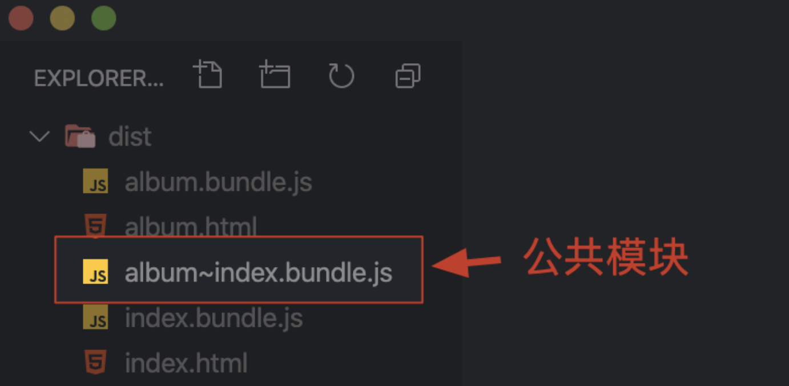

## All in One的弊端

通过webpack实现前端项目整体模块化优势固然明显，但也存在一些问题，他最终将所有的代码都打包在一起<br>
如果应用非常复杂，模块非常多，这种all in one的方式就会导致打包的结果非常大，甚至超过5M，应用响应速度会受到很大影响
所以这种**all in one的方式并不合理**

更为合理的方式是打包结果按照一定得规则分离到多个bundle中，然后根据应用的需要<span style="color: red;">**按需加载，降低启动成本，提高响应速度**</span><br>

Q：但是webpack的功能是将散落的模块打包在一起，提高效率，但是这里又要将打包模块拆开，这是否矛盾呢？<br>
A：web应用受到资源环境所限，<span style="color: red;">**太大不行，太碎也不行**</span><br>

因为在开发过程中，划分功能模块的颗粒度会非常细，一个功能模块通常只提供了一个小的工具函数，不能形成一个功能单元，如果不将这些模块打包在一起，而是按照开发时的模块划分，那么去运行一个小功能，就需要<div color="red">加载非常多的资源模块</div>

目前主流的HTTP1.1协议本身是有缺陷的，例如：
- 同一个域名下的并行请求是有限制的
- 每次请求都有一定得延时
- 每次请求除了传输内容，还有请求头，大量请求的情况下，这些请求头加在一起就造成了流量和带宽的浪费<br>

综上所述，模块的打包是必须的。但是当应用模块体积越来越大时，也要适当的拆分<br>

## code splitting通过把项目中的资源按照我们设计的规则打包到不同的bundle中，降低应用的启动成本，提高响应速度

### 目前webpack实现分包的方式主要有两种
1. 根据业务不同配置多个打包入口，输出多个打包结果
2. 结合ES Module的动态导入（Dynamic Imports）特性，按需加载模块

## 多入口打包的方式
- 多入口打包一般用于传统多页应用程序，最常见的划分规则就是一个页面对应一个打包入口，对于不同页面公共部分提取到公共的结果中
```
// 文件结构
├── dist
├── src
│   ├── common
│   │   ├── fetch.js
│   │   └── global.css
│   ├── album.css
│   ├── album.html
│   ├── album.js
│   ├── index.css
│   ├── index.html
│   └── index.js
├── package.json
└── webpack.config.js

```
- webpack.config.js配置
```javaScript
const HtmlWebpackPlugin = require('html-webpack-plugin')
module.exports = {
    mode: 'none',
    entry: {
        index: './src/index.js',
        album: './src/album.js'
    },
    output: {
        filename: '[name].bundle.js'
    },
    module: {
        rules: [
            {
                test: /\.css$/,
                use: [
                'style-loader',
                'css-loader'
                ]
            }
        ]
    },
    plugins: [
        new HtmlWebpackPlugin({
            title: 'Multi Entry',
            template: './src/index.html',
            filename: 'index.html',
            chunks: ['index']
        }),
        new HtmlWebpackPlugin({
            title: 'Multi Entry',
            template: './src/album.html',
            filename: 'album.html',
            chunks: ['album']
        })
    ]
}
```
- 这个示例中有两个页面，分别是 index 和 album。代码组织的逻辑也很简单：
index.js 负责实现 index 页面功能逻辑；
album.js 负责实现 album 页面功能逻辑；
global.css 是公用的样式文件；
fetch.js 是一个公用的模块，负责请求 API。

- 一般 entry 属性中只会配置一个打包入口，如果我们需要配置多个入口，可以把 entry 定义成一个对象。
> **注意：这里 entry 是定义为对象而不是数组，如果是数组的话就是把多个文件打包到一起，还是一个入口。**
- 在这个对象中一个属性就是一个入口，属性名称就是这个入口的名称，值就是这个入口对应的文件路径。那我们这里配置的就是 index 和 album 页面所对应的 JS 文件路径。
- 在配置中还通过 html-webpack-plugin 分别为 index 和 album 页面生成了对应的 HTML 文件。
- 完成配置之后，我们就可以打开命令行终端，运行 Webpack 打包，那此次打包会有两个入口。打包完成后，我们找到输出目录，这里就能看到两个入口文件各自的打包结果了，如下图所示：


- 但是这里还有一个小问题，我们打开任意一个输出的 HTML 文件。你就会发现 index 和 album 两个打包结果都被页面载入了，而我们希望的是每个页面只使用它对应的那个输出结果。
- 所以这里还需要修改配置文件，我们回到配置文件中，找到输出 HTML 的插件，默认这个插件会自动注入所有的打包结果，如果需要指定所使用的 bundle，我们可以通过 HtmlWebpackPlugin 的 chunks 属性来设置。我们分别为两个页面配置使用不同的 chunk，具体配置如下：
> TIPS：每个打包入口都会形成一个独立的 chunk（块）。
```javascript
// ./webpack.config.js
const HtmlWebpackPlugin = require('html-webpack-plugin')
module.exports = {
    entry: {
        index: './src/index.js',
        album: './src/album.js'
    },
    output: {
        filename: '[name].bundle.js' // [name] 是入口名称
    },
    // ... 其他配置
    plugins: [
        new HtmlWebpackPlugin({
            title: 'Multi Entry',
            template: './src/index.html',
            filename: 'index.html',
            chunks: ['index'] // 指定使用 index.bundle.js
        }),
        new HtmlWebpackPlugin({
            title: 'Multi Entry',
            template: './src/album.html',
            filename: 'album.html',
            chunks: ['album'] // 指定使用 album.bundle.js
        })
    ]
}
```
- 这样，每个页面就只引入了对应的包

## 提取公共模块
- 多入口打包本身非常容易理解和使用，但是它也存在一个小问题，就是不同的入口中一定会存在一些公共使用的模块，如果按照目前这种多入口打包的方式，就会出现多个打包结果中有相同的模块的情况。
- 例如我们上述案例中，index 入口和 album 入口中就共同使用了 global.css 和 fetch.js 这两个公共的模块。这里是因为我们的示例比较简单，所以重复的影响没有那么大，但是如果我们公共使用的是 jQuery 或者 Vue.js 这些体积较大的模块，那影响就会比较大，不利于公共模块的缓存。
- 所以我们还需要把这些公共的模块提取到一个单独的 bundle 中。Webpack 中实现公共模块提取非常简单，我们只需要在优化配置中开启 splitChunks 功能就可以了，具体配置如下：
```
// ./webpack.config.js
module.exports = {
    entry: {
        index: './src/index.js',
        album: './src/album.js'
    },
    output: {
        filename: '[name].bundle.js' // [name] 是入口名称
    },
    optimization: {
        splitChunks: {
            // 自动提取所有公共模块到单独 bundle
            chunks: 'all'
        }
    }
    // ... 其他配置
}
```
- 完成以后我们打开命令行终端，再次运行 Webpack 打包，打包结果如下图：

- 此时在我们的 dist 下就会额外生成一个 JS 文件，在这个文件中就是 index 和 album 中公共的模块部分了。splitChunks 还支持很多高级的用法，可以实现各种各样的分包策略，这些我们可以在文档中找到对应的介绍。

## 动态导入
除了多入口打包的方式，Code Splitting 更常见的实现方式还是结合 ES Modules 的动态导入特性，从而实现按需加载。<br>

按需加载是开发浏览器应用中一个非常常见的需求。一般我们常说的按需加载指的是加载数据或者加载图片，但是我们这里所说的按需加载，指的是在应用运行过程中，需要某个资源模块时，才去加载这个模块。这种方式极大地降低了应用启动时需要加载的资源体积，提高了应用的响应速度，同时也节省了带宽和流量。<br>

Webpack 中支持使用动态导入的方式实现模块的按需加载，而且所有动态导入的模块都会被自动提取到单独的 bundle 中，从而实现分包。<br>

相比于多入口的方式，动态导入更为灵活，因为我们可以通过代码中的逻辑去控制需不需要加载某个模块，或者什么时候加载某个模块。而且我们分包的目的中，很重要的一点就是让模块实现按需加载，从而提高应用的响应速度。<br>

- 看一个例子：
```
├── src
│   ├── album
│   │   ├── album.css
│   │   └── album.js
│   ├── common
│   │   ├── fetch.js
│   │   └── global.css
│   ├── posts
│   │   ├── posts.css
│   │   └── posts.js
│   ├── index.html
│   └── index.js
├── package.json
└── webpack.config.js
```
- 文章列表对应的是这里的 posts 组件，而相册列表对应的是 album 组件。我在打包入口（index.js）中同时导入了这两个模块，然后根据页面锚点的变化决定显示哪个组件，核心代码如下：
```javascript
// ./src/index.js
import posts from './posts/posts'
import album from './album/album'
const update = () => {
    const hash = window.location.hash || '#posts'
    const mainElement = document.querySelector('.main')
    mainElement.innerHTML = ''
    if (hash === '#posts') {
        mainElement.appendChild(posts())
    } else if (hash === '#album') {
        mainElement.appendChild(album())
    }
}
window.addEventListener('hashchange', update)
update()
```
- 在这种情况下，就可能产生资源浪费。试想一下：如果用户只需要访问其中一个页面，那么加载另外一个页面对应的组件就是浪费。
- 如果我们采用动态导入的方式，就不会产生浪费的问题了，因为所有的组件都是惰性加载，只有用到的时候才会去加载。具体实现代码如下：
```javascript
// ./src/index.js
// import posts from './posts/posts'
// import album from './album/album'
const update = () => {
    const hash = window.location.hash || '#posts'
    const mainElement = document.querySelector('.main')
    mainElement.innerHTML = ''
    if (hash === '#posts') {
        // mainElement.appendChild(posts())
        import('./posts/posts').then(({ default: posts }) => {
        mainElement.appendChild(posts())
        })
    } else if (hash === '#album') {
        // mainElement.appendChild(album())
        import('./album/album').then(({ default: album }) => {
            mainElement.appendChild(album())
        })
    }
}
window.addEventListener('hashchange', update)
update()
```
> P.S. 为了动态导入模块，可以将 import 关键字作为函数调用。当以这种方式使用时，import 函数返回一个 Promise 对象。这就是 ES Modules 标准中的 Dynamic Imports。

- 这里我们先移除 import 这种静态导入，然后在需要使用组件的地方通过 import 函数导入指定路径，那这个方法返回的是一个 Promise。在这个 Promise 的 then 方法中我们能够拿到模块对象。由于我们这里的 posts 和 album 模块是以默认成员导出，所以我们需要解构模块对象中的 default，先拿到导出成员，然后再正常使用这个导出成员。完成以后，Webpack Dev Server 自动重新打包，我们再次回到浏览器，此时应用仍然是可以正常工作的。

- 那我们再回到命令行终端，重新运行打包，然后看看此时的打包结果具体是怎样的。打包完成以后我们打开 dist 目录，具体结果如下图所示：

- 此时 dist 目录下就会额外多出三个 JS 文件，其中有两个文件是动态导入的模块，另外一个文件是动态导入模块中公共的模块，这三个文件就是由动态导入自动分包产生的。
- 以上就是动态导入在 Webpack 中的使用。整个过程我们无需额外配置任何地方，只需要按照 ES Modules 动态导入的方式去导入模块就可以了，Webpack 内部会自动处理分包和按需加载。
- 如果你使用的是 Vue.js 之类的 SPA 开发框架的话，那你项目中路由映射的组件就可以通过这种动态导入的方式实现按需加载，从而实现分包。

### 魔法注释

- 默认通过动态导入产生的 bundle 文件，它的 name 就是一个序号，这并没有什么不好，因为大多数时候，在生产环境中我们根本不用关心资源文件的名称。但是如果你还是需要给这些 bundle 命名的话，就可以使用 Webpack 所特有的魔法注释去实现。具体方式如下：
```javascript
// 魔法注释
import(/* webpackChunkName: 'posts' */'./posts/posts')
    .then(({ default: posts }) => {
        mainElement.appendChild(posts())
    })
```
- 所谓魔法注释，就是在 import 函数的形式参数位置，添加一个行内注释，这个注释有一个特定的格式：webpackChunkName: ''，这样就可以给分包的 chunk 起名字了。
- 除此之外，魔法注释还有个特殊用途：如果你的 chunkName 相同的话，那相同的 chunkName 最终就会被打包到一起，例如我们这里可以把这两个 chunkName 都设置为 components，然后再次运行打包，那此时这两个模块都会被打包到一个文件中。借助这个特点，你就可以根据自己的实际情况，灵活组织动态加载的模块了。


