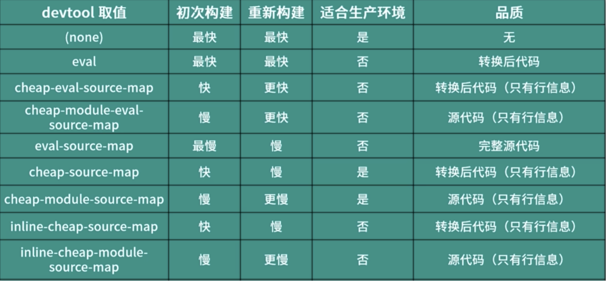

> > > 前言

-   必须能够使用 HTTP 服务器运行而不是文件形式预览。一来更加接近生产环境状态，二来我们的项目可能需要 ajax 之类的 API，以文件形式访问会产生很多问题
-   在我们修改文件之后，webpack 要能够自动完成构建，然后浏览器能够及时显示最新的结果，这样就大大减少了开发过程中额外的重复操作，同时让我们更加专注，效率自然提升。
-   需要能提供 source map 的支持，这样一来，在开发过程中出现的错误就能很快地位到出错的地方，而不是打包后的位置

# webpack 自动编译

-   watch 模式下：
-   webpack 完成初次构建后，项目中的文件会被监视，一旦发生改变，webpack 会自动重新运行打包任务

## 具体用法：

-   启动 webpack 时，在命令行中添加--watch 的 cli 参数，webpack 就会以监视模式运行，在打包完成之后，cli 不糊立即退出，会等待文件变化再次工作，直到手动结束他或出现不可控的异常

## webpack-dev-server

-   是 webpack 官方推出的开发工具
-   它提供了一个开发服务器，并且将自动编译和自动刷新等一系列对开发友好的功能集合在一起

-   npm i webpack-dev-server --save-dev
-   运行：npx webpack-dev-server

```flow
st=>start: 开始
op1=>operation: 启动服务器
op2=>operation: webpack构建
op3=>operation: 监视文件变化
e=>end

st->op1->op2->op3(right)->op2
```

## proxy 代理

-   在实际生产中能够直接访问 API，但在开发中如果服务器没有做 cors，就会产生跨域问题
-   解决跨域的问题，就是在开发服务器中配置一个后端 API 代理服务，也就是把后端服务代理到本地开发服务地址

-   用法：

```
devServer: {
    proxy: {
        '/api': {
            tagert: 'https://api.github.com', // 需要代理的地址
            changeOrigin: true, // 默认代理服务器会以实际在浏览器中请求的主机名(localhost:8080/***)作为代理的主机名，而服务器会根据主机名判断哪一个网站的请求，所以需要修改成目标地址的主机名去请求
            pathRewrite: {
                '^/api': '', // 替换调代理地址中的/api为空
            },
        },
    },
},
```

## 如何配置 source map

-   映射转换过后的代码和源代码的关系
-   map 文件中保存的是 json，主要的属性有:

```
// jquery-3.4.1.map
{
    "version": 3, // 当前map文件的版本
    "source": ["jquery-3.4.1.js"], // 记录的是打包的源代码；因为可能会多个文件打包，所以是一个数组
    "names": [
        "global",
        "factory",
        "module",
        "exports",
        "document",
        ...
    ], // 源代码中的成员名称。在压缩时，压缩工具会把代码中有意义的变量名称压缩成简短的字符，以此来增加压缩比例，这里记录的就是源代码中的名称
    "mapings": "", // 这也是最重要的属性，里面记录的是通过base64编码过后的字符和转换前字符的关系
}
```

-   sourcemap 配置

```
// webpack.config.js
{
    module.exports = {
        devtool: "source-map",
    }
}
// 如果不设置devtool: "source-map",那么在页面上的报错会被定位到打包后的文件的报错的位置
// 设置之后，会被定位到具体的报错的文件的位置
```

-   不同的生成 source-map 的方式，速度是不一样的
    
-   [官方 devtool 配置对比](https://webpack.docschina.org/configuration/devtool/#src/components/Sidebar/Sidebar.jsx)

### eval 模式

-   指的是 JS 中的一个函数，可以用来运行字符串中的 JS 代码
    `eval("// extracted by mini-css-extract-plugin\n\n//# sourceURL=webpack://%5Bname%5D/./src/index.scss?");`
-   每一个模块都被打包到了 eval 函数中，并且都通过//# sourceURL=webpack:/// ./src/\*\*?声明是属于哪一个模块的
-   但是在打包过后的文件中，通过报错信息点击文件，看到的文件内容是打包过后的
-   综上：eval 模式会将所有的模块打包到 eval 函数中执行，通过//# sourceURL 声明文件路径，不会生成 map 文件，它只能知道是哪一个文件报错，不能知道报错信息在哪一行发生

### eval-source-map 模式

-   不能用于生产环境

### cheap-eval-source-map 模式

-   不能用于生产环境，只能定位到行，定位的代码是经过 loader 处理了的，将 ES6 转换过后的结果

### cheap-source-map 模式

-   只能定位到行不能定位到列

### cheap-module-source-map 模式

-   这种模式定位的源代码和我们编写的源代码一模一样。没有转换 ES6 的代码
-   这也就是要给 js 配置 loader 的原因，因为这种名字中带有 module 的模式，解析出来是没有经过 loader 加工的，名字中没有 module 的模式，解析出来的是经过 loader 加工的，也就是说我们想要还原一模一样的代码，就需要使用 cheap-module-eval-source-map 模式

### inline-source-map 模式

-   跟普通 source-map 模式效果相同，只不过这种模式下 source-map 不是以物理文件形式存在，而是以 data URLs 的方式出现在代码中。eval-source-map 也是这种 inline 方式

## 写在最后

-   我个人使用 cheap-module-eval-source-map 模式
-   我平时使用框架会比较多，React 和 Vue，无论是 jsx 还是 vue 单文件组件，loader 转换后的差别都比较大，我需要调试转换前的代码
-   一般情况下，我在项目中设置的 eslint 规范，在 html 中不会超过 200 个字符，在 js 逻辑中也不会超过 100 个字符。如果报错，定位到行也能够满足需求，能排查出来错误的原因了，还可以提升构建速度。
-   虽然在启动打包时比较慢，但大多数时候是使用 webpack-dev-server 在监视模式下(--open)构建打包，它重新打包的速度很快，所以也能满足需求。

---

---

## 自动刷新的问题

-   使用 Webpack Dev Server 就可以让我们在开发过程中专注编码，因为它可以自动监视我们代码的变化然后自动进行打包，最后通过自动刷新的方式同步到浏览器以便于我们即时预览
-   但是当你实际去使用 Webpack Dev Server 自动刷新的特性去完成具体的开发任务时，你会发现还是有一些不舒服的地方。
-   例如，这里是一个编辑器应用，我想要即时调试这个编辑器中内容文本的样式。那正常的操作肯定是我先尝试在编辑器里面去添加一些文本，作为展示样例，再回到开发工具中，找到控制编辑器样式的 CSS 文件，然后进行编辑。
-   那这时候我们就能够发现问题了：当我们修改完编辑器文本对应的样式过后，原本想着可以即时看到最新的界面效果，但是这时编辑器中的内容却没有了。这时就不得不再次回到应用中再来添加一些测试文本，查看样式效果。那如果修改后还是对样式不满意的话，你还需要继续调整样式，调整之后又会面临文本内容丢失的问题。那久而久之你就会发现，自动刷新这个功能还是有点鸡肋，并没有想象的那么好用。
-   出现这个问题的原因，是因为我们每次修改完代码，Webpack 都可以监视到变化，然后自动打包，再通知浏览器自动刷新，一旦页面整体刷新，那页面中的任何操作状态都将会丢失，所以才会出现我们上面所看到的情况。

## 模块支持热替换(HMR)

-   全称 hot module replacement,翻译模块热更新，指在运行过程中的即时变化
-   hmr 已经集成到了 webpack-dev-server，所以不需要单独安装插件
-   在运行 webpack-dev-server 时，只需要传入--hot 参数去开启这个特性
-   也可以通过配置文件，在 devServer 中 hot 设置为 ture,同时导入 webpack, 使用 HotModuleReplacementPlugin 插件

## 开启热更新

```
{
    devServer: {
        // 开启 HMR 特性，如果资源不支持 HMR 会 fallback 到 live reloading
        hot: true
        // 只使用 HMR，不会 fallback 到 live reloading
        // hotOnly: true
    },
    plugins: [
        new webpack.HotModuleReplacementPlugin(),
    ],
}
```

## HMR 疑问？

-   Q： 为什么开启 HMR 后，样式文件的修改支持热更新
-   A： 因为样式文件是经过了 loader 的处理，而在 style-loader 中就已经自动处理了样式文件的热更新，所以就不需要额外手动处理

-   Q： 为什么样式就可以自动处理，而我们的脚本就需要自己手动处理呢？
-   A： 因为样式模块更新过后，只需要把更新后的 CSS 及时替换到页面中，它就可以覆盖掉之前的样式，从而实现更新。而我们所编写的 JavaScript 模块是没有任何规律的，你可能导出的是一个对象，也可能导出的是一个字符串，还可能导出的是一个函数，使用时也各不相同。所以 Webpack 面对这些毫无规律的 JS 模块，根本不知道该怎么处理更新后的模块，也就无法直接实现一个可以通用所有情况的模块替换方案。那这就是为什么样式文件可以直接热更新，而 JS 文件更新后页面还是回退到自动刷新的原因。

-   Q： 平时使用 vue-cli 或者 create-react-app 这种框架脚手架工具的人会说，“我的项目就没有手动处理，JavaScript 代码照样可以热替换？
-   A： 这是因为你使用的是框架，使用框架开发时，我们项目中的每个文件就有了规律，例如 React 中要求每个模块导出的必须是一个函数或者类，那这样就可以有通用的替换办法，所以这些工具内部都已经帮你实现了通用的替换操作，自然就不需要手动处理了。

-   **综上所述，我们还是需要自己手动通过代码来处理，当 JavaScript 模块更新过后，该如何将更新后的模块替换到页面中。**

## HMR APIs

-   HotModuleReplacementPlugin 为我们的 JavaScript 提供了一套用于处理 HMR 的 API，我们需要在我们自己的代码中，使用这套 API 将更新后的模块替换到正在运行的页面中。

```
// ./src/main.js
import createEditor from './editor'
import logo from './icon.png'

const img = new Image()
img.src = logo
document.body.appendChild(img)

const editor = createEditor()
document.body.appendChild(editor)

```

-   这是 Webpack 打包的入口文件，正常情况下，在这个文件中会加载一些其他模块。正是因为在 main.js 中使用了这些模块，所以一旦这些模块更新了过后，我们在 main.js 中就必须重新使用更新后的模块。我们需要在这个文件中添加一些额外的代码，去处理它所依赖的这些模块更新后的热替换逻辑。
-   **对于开启 HMR 特性的环境中，我们可以访问到全局的 module 对象中的 hot 成员。这个成员是一个对象，这个对象就是 HMR API 的核心对象，它提供了一个 accept 方法，用于注册当某个模块更新后的处理函数。accept 方法第一个参数接收的就是所监视的依赖模块路径，第二个参数就是依赖模块更新后的处理函数。**
-   那我们这里先尝试注册 ./editor 模块更新过后的处理函数，第一个参数就是 editor 模块的路径，第二个参数则需要我们传入一个函数，然后在这个函数中打印一个消息，具体代码如下：

```
// ./main.js
// ... 原本的业务代码
module.hot.accept('./editor', () => {
  // 当 ./editor.js 更新，自动执行此函数
  console.log('editor 更新了～～', createEditor)
})
```

-   如果我们修改了 editor 模块，保存过后，浏览器的控制台中就会自动打印我们上面在代码中添加的消息，而且浏览器也不会自动刷新了。那也就是说一旦这个模块的更新被我们手动处理了，就不会触发自动刷新；反之，如果没有手动处理，热替换会自动 fallback（回退）到自动刷新。

## JS 模块热替换

-   在以上的代码中会打印"editor 更新了～～" 和 createEditor 函数。修改 editor 模块，保存过后，你就会发现当模块更新后，我们这里拿到的 createEditor 函数也就更新为了最新的结果
-   既然模块文件更新后 createEditor 函数可以自动更新，那剩下的就好办了。我们这里使用 createEditor 函数是用来创建一个界面元素的，那模块一旦更新了，这个元素也就需要重新创建，所以我们这里先移除原来的元素，然后再调用更新后的 createEditor 函数，创建一个新的元素追加到页面中，具体代码如下：

```
// ./main.js
import createEditor from './editor'

const editor = createEditor()
document.body.appendChild(editor)

// ... 原本的业务代码

// HMR -----------------------------------
let lastEditor = editor
module.hot.accept('./editor', () => {
  document.body.removeChild(lastEditor) // 移除之前创建的元素
  const newEditor = createEditor() // 用新模块创建新元素
  document.body.appendChild(newEditor)
})
```

-   完成以后，我们再来尝试修改 editor 模块，此时就应该是正常的热替换效果了。

## 热替换的状态保持

-   如果我们尝试在界面上输入一些内容（形成页面操作状态），然后回到代码中再次修改 editor 模块。那此时你仍然会发现问题，由于热替换时，把界面上之前的编辑器元素移除了，替换成了一个新的元素，所以页面上之前的状态同样会丢失。这也就证明我们的热替换操作还需要改进，我们必须在替换时把状态保留下来。

-   想保留这个状态也很简单，就是在替换前先拿到编辑器中的内容，然后替换后在放回去就行了。那因为我这里使用的是可编辑元素，而不是文本框，所以我们需要通过 innerHTML 拿到之前编辑的内容，然后设置到更新后创建的新元素中，具体代码如下：

```
// ./main.js
import createEditor from './editor'
const editor = createEditor()
document.body.appendChild(editor)
// ... 原本的业务代码
// HMR --------------------------------
let lastEditor = editor
module.hot.accept('./editor', () => {
    // 当 editor.js 更新，自动执行此函数
    // 临时记录更新前编辑器内容
    const value = lastEditor.innerHTML
    // 移除更新前的元素
    document.body.removeChild(lastEditor)
    // 创建新的编辑器
    // 此时 createEditor 已经是更新过后的函数了
    lastEditor = createEditor()
    // 还原编辑器内容
    lastEditor.innerHTML = value
    // 追加到页面
    document.body.appendChild(lastEditor)
})
```

-   至此，对于 editor 模块的热替换逻辑就算是全部实现了。通过这个过程应该能够发现，为什么 Webpack 需要我们自己处理 JS 模块的热更新了：因为不同的模块有不同的情况，不同的情况，在这里处理时肯定也是不同的。就好像，我们这里是一个文本编辑器应用，所以需要保留状态，如果不是这种类型那就不需要这样做。所以说 Webpack 没法提供一个通用的 JS 模块替换方案。

## 图片模块热替换

-   相比于 JavaScript 模块热替换，图片的热替换逻辑就简单多了
-   我们同样通过 module.hot.accept 注册这个图片模块的热替换处理函数，在这个函数中，我们只需要重新给图片元素的 src 设置更新后的图片路径就可以了。因为图片修改过后图片的文件名会发生变化，而这里我们就可以直接得到更新后的路径，所以重新设置图片的 src 就能实现图片热替换，具体代码如下：

```
// ./src/main.js
import logo from './icon.png'
// ... 其他代码
module.hot.accept('./icon.png', () => {
  // 当 icon.png 更新后执行
  // 重写设置 src 会触发图片元素重新加载，从而局部更新图片
  img.src = logo
})
```

## 常见问题

-   如果处理热替换的代码（处理函数）中有错误，结果也会导致自动刷新。例如我们这里在处理函数中故意加入一个运行时错误，代码如下:

```
// ./src/main.js
module.hot.accept('./editor', () => {
  // 刻意造成运行异常
  undefined.foo()
})
```

-   直接测试你会发现 HMR 不会正常工作，而且根本看不到异常
-   这是因为 HMR 过程报错导致 HMR 失败，HMR 失败过后，会自动回退到自动刷新，页面一旦自动刷新，控制台中的错误信息就会被清除，这样的话，如果不是很明显的错误，就很难被发现。
-   在这种情况下，我们可以使用 hotOnly 的方式来解决，因为现在使用的 hot 方式，如果热替换失败就会自动回退使用自动刷新，而 hotOnly 的情况下并不会使用自动刷新。
-   在配置文件中，这里我们将 devServer 中的 hot 等于 true 修改为 hotOnly 等于 true 即可。此时我们再去修改代码，无论是否处理了这个代码模块的热替换逻辑，浏览器都不会自动刷新了

-   第二个问题，对于使用了 HMR API 的代码，如果我们在没有开启 HMR 功能的情况下运行 Webpack 打包，此时运行环境中就会报出 Cannot read property 'accept' of undefined 的错误，具体错误信息如下：
-   [HMR 报错信息](./static/images/hotReplaceError.png)

-   原因是 module.hot 是 HMR 插件提供的成员，没有开启这个插件，自然也就没有这个对象。
-   解决办法也很简单，与我们在业务代码中判断 API 兼容一样，我们先判断是否存在这个对象，然后再去使用就可以了，具体代码如下：

```
// HMR -----------------------------------
if (module.hot) { // 确保有 HMR API 对象
  module.hot.accept('./editor', () => {
    // ...
  })
}
```

-   另一个问题：我们在代码中写了很多与业务功能本身无关的代码，会不会对生产环境有影响？
-   我们回到配置文件中，确保已经将热替换特性关闭，并且移除掉了 HotModuleReplacementPlugin 插件，（此时 module.hot=false）然后打开命令行终端，正常运行一下 Webpack 打包，打包过后，我们找到打包生成的 bundle.js 文件，然后找到里面 main.js 对应的模块，具体结果如下图：
-   [关闭 HMR 之后，手写的 JS 热替换代码](./static/images/bundle.png)
-   我们能看到被打包之后的代码 if(false) {}，是一个 if 条件是 false 的空语句，对于没有意义的空语句，在压缩代码时，不会被打包到最后的压缩代码中，所以手动写的 JS 代码热替换的逻辑根本不会对生产环境有任何影响。

-   [Vue HMR 热更新方案](https://vue-loader.vuejs.org/guide/hot-reload.html)
-   [React HMR 热更新方案](https://github.com/gaearon/react-hot-loader)
