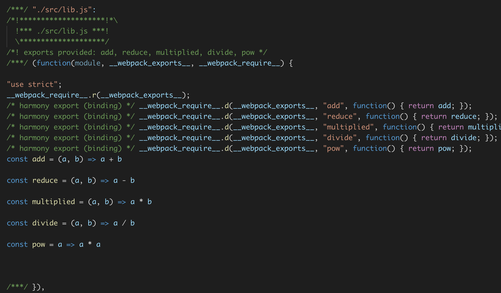
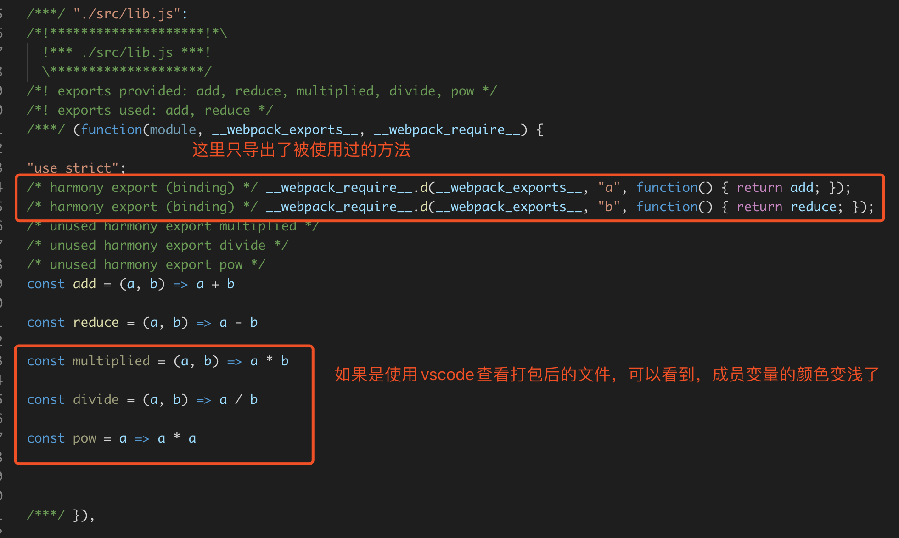
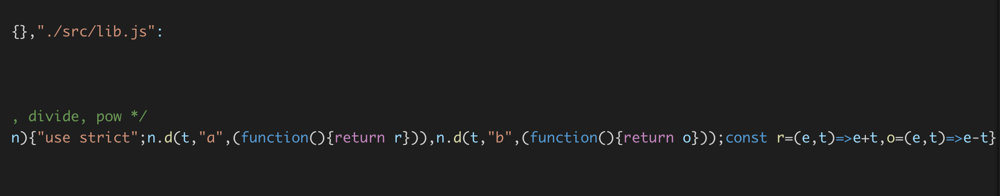
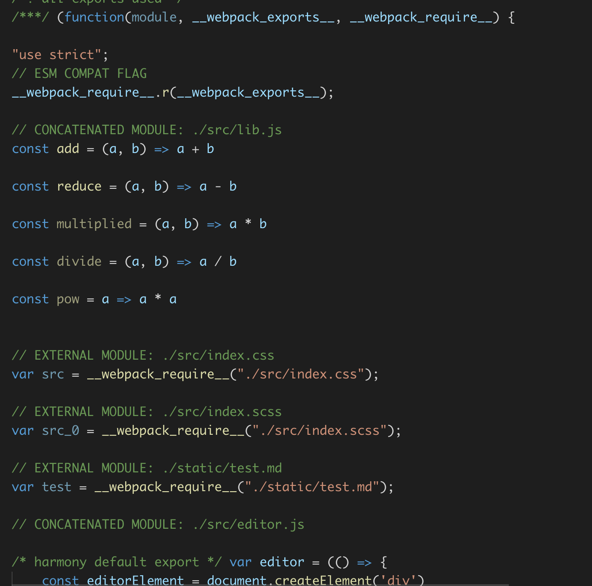
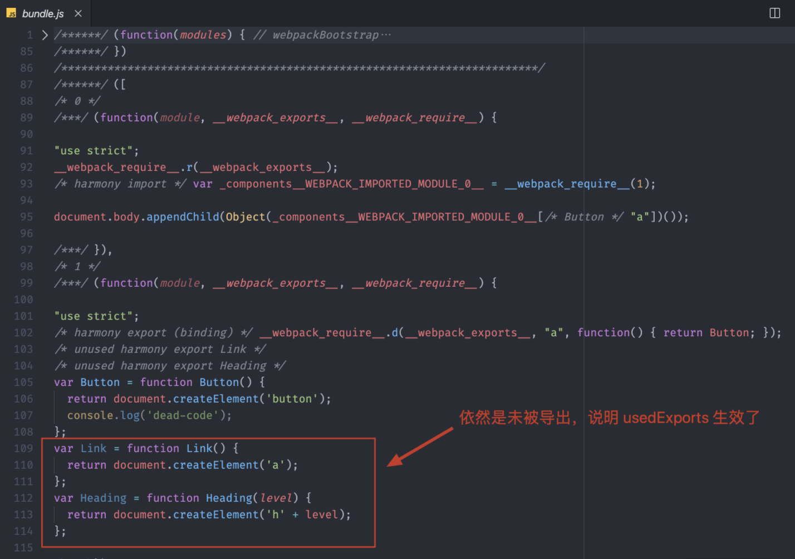
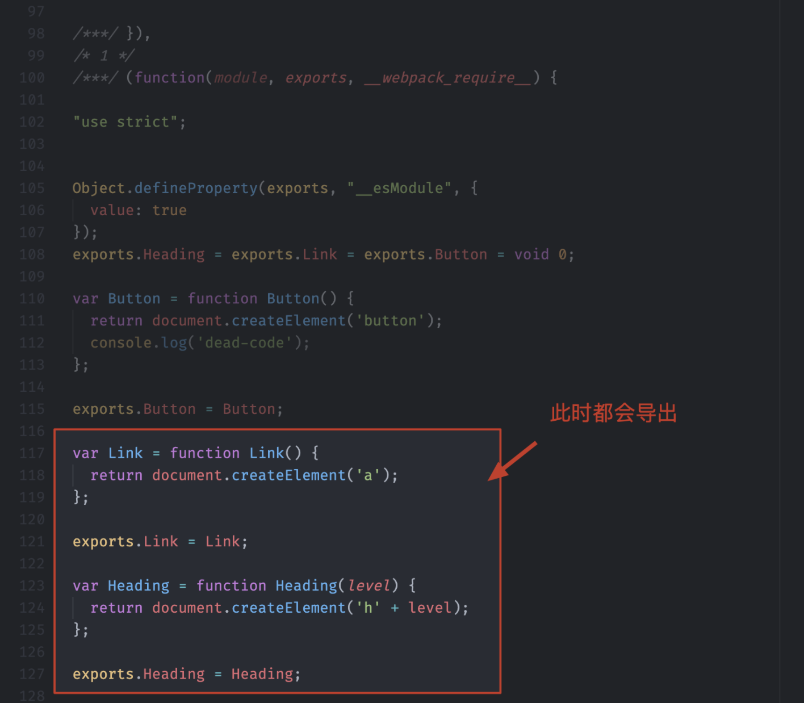
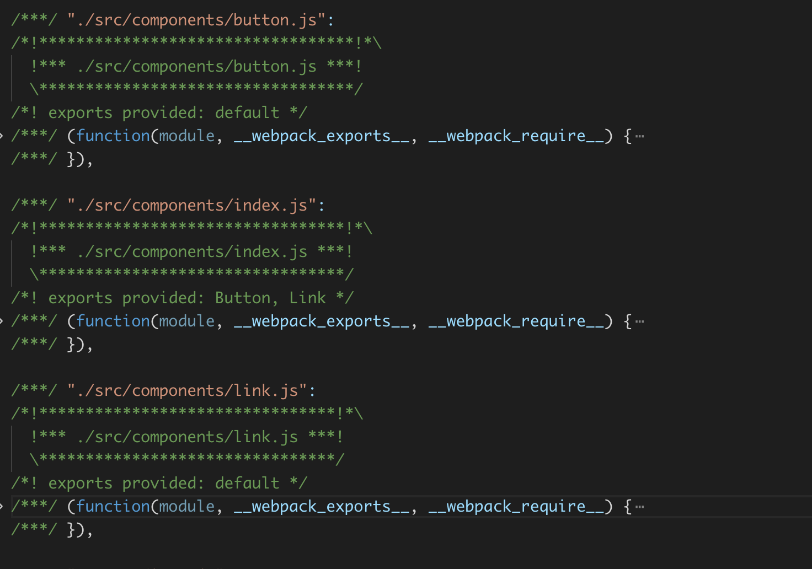
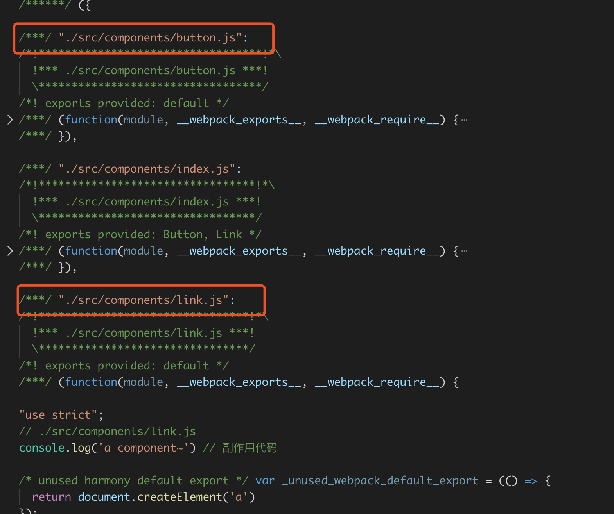

## tree shaking 是一个术语，通常用于描述移除 JavaScript 上下文中的未引用代码(dead-code)。它依赖于 ES2015 模块系统中的静态结构特性

- AST 对 JS 代码进行语法分析后得出的语法树 (Abstract Syntax Tree)。AST语法树可以把一段 JS 代码的每一个语句都转化为树中的一个节点。

- DCE Dead Code Elimination，在保持代码运行结果不变的前提下，去除无用的代码。这样的好处是:
   
   1. 减少程序体积
   2. 减少程序执行时间
   3. 便于将来对程序架构进行优化

- 而所谓 Dead Code 主要包括：
   
   1. 程序中没有执行的代码 (如不可能进入的分支，return 之后的语句等)
   2. 导致 dead variable 的代码(写入变量之后不再读取的代码)

- 基于 ES6 的静态引用，tree shaking 通过扫描所有 ES6 的 export，找出被 import 的内容并添加到最终代码中。 webpack 的实现是把所有 import 标记为有使用/无使用两种，在后续压缩时进行区别处理。


## 压缩输出
- 通过如上方式，我们已经可以通过 import 和 export 语法，找出那些需要删除的“未使用代码(dead code)”，然而，我们不只是要找出，还需要在 bundle 中删除它们。为此，我们将使用 -p(production) 这个 webpack 编译标记，来启用 uglifyjs 压缩插件。

- 所以在tree shaking时，环境需要是prodcution，在webpack4中，环境是production时，会内部调用 UglifyJsPlugin

- 新的 webpack 4 正式版本，扩展了这个检测能力，通过 package.json 的 "sideEffects" 属性作为标记，向 compiler 提供提示，表明项目中的哪些文件是 "pure(纯的 ES2015 模块)"，由此可以安全地删除文件中未使用的部分。


## 通过以上我们知道在生产模式下，webpack会自动开启Tree Shaking，那么在其他环境下，怎么开启tree shaking呢？
先设置mode="none | development", devtool="source-map"方便查看打包之后的结构
- 在执行打包命令之后，可以看到如下图：


- 在没有开启tree-shaking时，打包时，将lib.js中的所有方法都打包进来了

- 我们在配置文件中配置optimization: { usedExports: true },表示只导出外部使用了的方法。再次打包，结果如下图：

- 我们可以看到，只引用了我们使用过的方法，未使用的方法没有被导出，如果是用vscode查看打包后的代码，可以看到未被使用的成员变量颜色变浅，结合压缩代码的插件，未被使用的变量不会被打包到最后的打包代码中。
- 我们再配置optimization: { minimize: true }, 表示开启代码压缩，最后的打包结果就不会看到未被使用的成员变量被打包进去。

- 可以看到开启tree-shaking并压缩代码之后，未被使用的成员变量没有被打包进去。

- 在这里我们使用了两个webpack的优化功能
- usedExports: ture, 表示打包结果只导出外部使用过的成员
- minimize: ture, 表示打包结果

- 如果把代码看成一颗大树，可以这样理解：
- usedExports的作用就是标记树上哪些是枯叶
- minimize的作用就是负责把枯叶从树上摇下来

- 还有一个优化属性——concatenateModules: ture, 表示尽可能合并每一个模块到一个函数中

- 可以看到，所有的在index.js中引入的模块都被打包在一个函数中
- 这样的特性被称为scope Hoisting，作用域提升。这是webpack3.0中添加的新特性，这样配合minimize选项，打包的体积又会缩小很多

## Tree-shaking和babel-loader结合使用的问题

- 要明确一点，tree-shaking实现的前提是ES-module,就是说最终交给webpack的代码，必须是通过es module的方式来组织模块化
- 因为webpack在打包所有的模块的之前，都会将对应的模块交到对应的loader处理，最后将loader处理过后的代码打包在一起
- 有时我们选择更好的兼容性，我们会选择babel-loader处理代码，而babel-loader处理代码的时候，很可能就处理掉了es module的代码，将他们转换成了commonJS的方式，babel-loader最终会不会处理es module要看我们是否配置了使用转换es module的插件，因为babel是基于插件机制。

- 很多时候，我们为 Babel 配置的都是一个 preset（预设插件集合），而不是某些具体的插件。例如，目前市面上使用最多的 @babel/preset-env，这个预设里面就有转换 ES Modules 的插件。所以当我们使用这个预设时，代码中的 ES Modules 部分就会被转换成 CommonJS 方式。那 Webpack 再去打包时，拿到的就是以 CommonJS 方式组织的代码了，所以 Tree-shaking 不能生效。

- 那我们这里具体来尝试一下。为了可以更容易分辨结果，我们只开启 usedExports，完整配置如下：
```
// ./webpack.config.js
module.exports = {
    mode: 'none',
    entry: './src/main.js',
    output: {
        filename: 'bundle.js'
    },
    module: {
        rules: [
            {
                test: /\.js$/,
                use: {
                    loader: 'babel-loader',
                    options: {
                        presets: [
                            ['@babel/preset-env']
                        ]
                    }
                }
            }
        ]
    },
    optimization: {
        usedExports: true
    }
}

```
- 配置完成过后，我们打开命令行终端，运行 Webpack 打包命令，然后再找到 bundle.js，具体结果如下：

- 仔细查看你会发现，结果并不是像刚刚说的那样，这里 usedExports 功能仍然正常工作了，此时，如果我们压缩代码，这些未引用的代码依然会被移除。这也就说明 Tree-shaking 并没有失效。
- 为什么很多资料都说 babel-loader 会导致 Tree-shaking 失效，但当我们实际尝试后又发现并没有失效？
- 其实，这是因为在最新版本（8.x）的 babel-loader 中，已经自动帮我们关闭了对 ES Modules 转换的插件，你可以参考对应版本 babel-loader 的源码。
- 通过查阅 babel-loader 模块的源码，我们发现它已经在 injectCaller 函数中标识了当前环境支持 ES Modules。
- 然后再找到我们所使用的 @babal/preset-env 模块源码。位于@babel/preset-env模块下src/index.js 264-274行，判断逻辑在109-113行。
- 在这个模块中，根据环境标识自动禁用了对 ES Modules 的转换插件，所以经过 babel-loader 处理后的代码默认仍然是 ES Modules，那 Webpack 最终打包得到的还是 ES Modules 代码，Tree-shaking 自然也就可以正常工作了。

- 我们也可以在 babel-loader 的配置中强制开启 ES Modules 转换插件来试一下，具体配置如下：
```
// ./webpack.config.js
module.exports = {
    module: {
        rules: [
            {
                test: /\.js$/,
                use: {
                    loader: 'babel-loader',
                    options: {
                        presets: [
                            ['@babel/preset-env', { modules: 'commonjs' }]
                        ]
                    }
                }
            }
        ]
    },
    optimization: {
        usedExports: true
    }
}
```
- 给 Babel preset 添加配置的方式比较特别，这里很多人都会配错，一定要注意。它需要把预设数组中的成员定义成一个数组，然后这个数组中的第一个成员就是所使用的 preset 的名称，第二个成员就是给这个 preset 定义的配置对象。
- 我们在这个对象中将 modules 属性设置为 "commonjs"，默认这个属性是 auto，也就是根据环境判断是否开启 ES Modules 插件，我们设置为 commonjs 就表示我们强制使用 Babel 的 ES Modules 插件把代码中的 ES Modules 转换为 CommonJS。
- 完成以后，我们再次打开命令行终端，运行 Webpack 打包。然后找到 bundle.js，结果如下：

- 此时，你就会发现 usedExports 没法生效了。即便我们开启压缩代码，Tree-shaking 也会失效。
- 总结一下，这里通过实验发现，最新版本的 babel-loader 并不会导致 Tree-shaking 失效。如果你不确定现在使用的 babel-loader 会不会导致这个问题，最简单的办法就是在配置中将 @babel/preset-env 的 modules 属性设置为 false，确保不会转换 ES Modules，也就确保了 Tree-shaking 的前提。

## sideEffects
- 新的 webpack 4 正式版本，扩展了这个检测能力，通过 package.json 的 "sideEffects" 属性作为标记，向 compiler 提供提示，表明项目中的哪些文件是 "pure(纯的 ES2015 模块)"，由此可以安全地删除文件中未使用的部分

```
{
    "sideEffects": false
}
```

- 如果你的代码确实有一些副作用，那么可以改为提供一个数组：
```
{
    "sideEffects": [
        "./src/some-side-effectful-file.js",
        "*.css",
        "*.scss",
    ]
}
```
- Webpack 4 中新增了一个 sideEffects 特性，它允许我们通过配置标识我们的代码是否有副作用，从而提供更大的压缩空间。
>>> **模块的副作用指的就是模块执行的时候除了导出成员，是否还做了其他的事情。**
- 这个特性一般只有我们去开发一个 npm 模块时才会用到。因为官网把对 sideEffects 特性的介绍跟 Tree-shaking 混到了一起，所以很多人误认为它们之间是因果关系，其实它们没有什么太大的关系。

- 我们把 components 模块拆分出多个组件文件，然后在 components/index.js 中集中导出，以便于外界集中导入，具体 index.js 代码如下：
```
// ./src/components/index.js
export { default as Button } from './button'
export { default as Link } from './link'
```
- 那这样就会出现一个问题，虽然我们在这里只是希望载入 Button 模块，但实际上载入的是 components/index.js，而 index.js 中又载入了这个目录中全部的组件模块，这就会导致所有组件模块都会被加载执行。

根据打包结果发现，所有的组件模块都被打包进去了
- 此时如果我们开启 Tree-shaking 特性（只设置 useExports: ture），这里没有用到的导出成员其实最终也可以被移除，打包效果如下：

- 但是由于这些成员所属的模块中有副作用代码，所以就导致最终 Tree-shaking 过后，这些模块并不会被完全移除。
- 可能你会认为这些代码应该保留下来，而实际情况是，这些模块内的副作用代码一般都是为这个模块服务的，例如这里我添加的 console.log，就是希望表示一下当前这个模块被加载了。但是最终整个模块都没用到，也就没必要留下这些副作用代码了。
- 所以说，Tree-shaking 只能移除没有用到的代码成员，而想要完整移除没有用到的模块，那就需要开启 sideEffects 特性了。

- 我们打开 Webpack 的配置文件，在 optimization 中开启 sideEffects 特性，具体配置如下：
```
// ./webpack.config.js
module.exports = {
    mode: 'none',
    entry: './src/main.js',
    output: {
        filename: 'bundle.js'
    },
    optimization: {
        sideEffects: true
    }
}
```
> **TIPS：注意这个特性在 production 模式下同样会自动开启。**
- 那此时 Webpack 在打包某个模块之前，会先检查这个模块所属的 package.json 中的 sideEffects 标识，以此来判断这个模块是否有副作用，如果没有副作用的话，这些没用到的模块就不再被打包。换句话说，即便这些没有用到的模块中存在一些副作用代码，我们也可以通过 package.json 中的 sideEffects 去强制声明没有副作用。
- 那我们打开项目 package.json 添加一个 sideEffects 字段，把它设置为 false，具体代码如下：
```
{
    "name": "09-side-effects",
    "version": "0.1.0",
    "author": "zce <w@zce.me> (https://zce.me)",
    "license": "MIT",
    "scripts": {
        "build": "webpack"
    },
    "devDependencies": {
        "webpack": "^4.43.0",
        "webpack-cli": "^3.3.11"
    },
    "sideEffects": false
}
```
- 这样就表示我们这个项目中的所有代码都没有副作用，让 Webpack 放心大胆地去“干”。
- 完成以后我们再次运行打包，就不会看到未被使用的代码被打包进来了。
- **注意在package.json中配置"sideEffects": false的话，在js中引入的样式文件也不会被打包**
- **所以在package.json中应该配置"sideEffects": ["*.css", "*.scss"]等等其他你项目中用到的样式文件**
- 再在webpack中配置optimization: { sideEffects: true }
- 这样就可以放心打包，不用担心未被使用的模块也被打包进去了，这样会大大节省打包过后的代码体积

# sideEffects 注意
- 使用 sideEffects 这个功能的前提是确定你的代码没有副作用，或者副作用代码没有全局影响，否则打包时就会误删掉你那些有意义的副作用代码。
- 例如，我这里准备的 extend.js 模块：
```
// ./src/extend.js
// 为 Number 的原型添加一个扩展方法
Number.prototype.pad = function (size) {
    const leadingZeros = Array(size + 1).join(0)
    return leadingZeros + this
}

// ./src/main.js
import './extend' // 内部包含影响全局的副作用
console.log((8).pad(3)) // => '0008'
```
- 因为这个模块确实没有导出任何成员，所以这里也就不需要提取任何成员。导入过后就可以使用它为 Number 提供扩展方法了。这里为 Number 类型做扩展的操作就是 extend 模块对全局产生的副作用。
- 此时如果我们还是通过 package.json 标识我们代码没有副作用，那么再次打包过后，就会出现问题。**Number 的扩展模块并不会打包进来。**
- 缺少了对 Number 的扩展操作，我们的代码再去运行的时候，就会出现错误。这种扩展的操作属于对全局产生的副作用。
- 这种基于原型的扩展方式，在很多 Polyfill 库中都会大量出现，比较常见的有 es6-promise，这种模块都属于典型的副作用模块。
- 最好的办法就是在 package.json 中的 sideEffects 字段中标识需要保留副作用的模块路径（可以使用通配符）
```
"sideEffects": [
    "./src/extend.js", // 设置具体的哪个文件会有副作用，打包时Webpack的sideEffects就不会忽略有必要的副作用模块了。
    "*.css"
]
```


