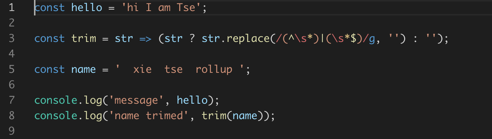

## 如何选择打包工具 Rollup和webpack

> 前言
Rollup是一款ES Module打包器，它可以将项目中散落的细小模块打包成整块代码，从而可以这些模块可以更好的运行在浏览器端或NodeJS环境，它的作用于webpack非常类似，但是小巧很多。<br>
它诞生的目的是提供一个高效的ES Module模块打包器，充分利用ES Modules的各项特性构建结构扁平，性能出众的类库。<br>

- 这里我准备了一个简单的示例，具体结构如下：
## 快速上手
```
├── rollupsrc
│   ├── index.js
│   ├── utils.js
│   └── messages.js
└── package.json
```
- 在这个示例的源代码中我准备了三个文件，并且使用 ES Modules 组织的代码模块化。部分代码如下：
```
// ./rollupsrc/messages.js
const hello = 'hi I am Tse'
export default hello

// ./rollupsrc/utils.js
export const checker = value => !!value
export const trim = str => (str ? str.replace(/(^\s*)|(\s*$)/g, '') : '');

// ./rollupsrc/index.js
import message from './message'
import { trim } from './utils.js'

const name = '  xie  tse rollup '
console.log('message', message)
console.log('name trimed', trim(name))
```
- 安装Rollup  npm i rollup --save-dev
- 安装完成过后，rollup 这个模块同样会在 node_modules/.bin 目录中为我们提供一个 CLI 程序，我们就可以通过这个 CLI 去使用 Rollup 打包。具体命令如下：
- `npx rollup`
> P.S. 对于 node_modules/.bin 目录下的 CLI，我们可以使用 npx 命令或者 yarn 命令直接启动。
- 当然，正常情况下我们还是需要将打包结果输出到一个文件中。具体就是通过 CLI 的 --file 参数指定输出文件路径，具体命令如下：
- `npx rollup ./rollupsrc/index.js --file ./drollupdist/bundle.js`
- 完成以后，我们找到 Rollup 打包输出的文件，具体结果如下：


- 在这个文件中我们的第一印象就是，Rollup 打包结果惊人的简洁，基本上就跟我们手写的代码一样。相比于 Webpack 大量的引导代码和一堆的模块函数，这里的输出结果没有任何多余代码，就是把打包过程中的各个模块按照依赖顺序，先后拼接到了一起。而且我们仔细观察打包结果，你会发现，在我们输出的结果中只会保留那些用到的部分，对于未引用部分都没有输出。这是因为 Rollup 默认会自动开启 Tree-shaking 优化输出结果，Tree-shaking 的概念最早也就是 Rollup 这个工具提出的。

- Rollup 同样支持以配置文件的方式去配置打包过程中的各项参数，我们可以在项目的根目录下新建一个 **rollup.config.js**的配置文件
```JavaScript
// ./rollup.config.js
export default {
    input: 'rollupsrc/index.js',
    output: {
        file: 'rollupdist/bundle.js',
        format: 'es' // 输出格式
    }
}
```
- 这个文件中需要导出一个配置对象，在这个对象中我们可以通过 input 属性指定打包的入口文件路径，通过 output 指定输出相关配置，output 属性是一个对象，在 output 对象中可以使用 file 属性指定输出的文件名，format 属性指定输出代码的格式。
- 完成以后，我们回到命令行，再次执行 rollup 命令，不过需要注意的是，这里需要通过 --config 参数来表明使用项目中的配置文件。你也可以通过这个参数来指定不同的配置文件名称。具体命令如下：
```JavaScript
$ npx rollup --config # 使用默认配置文件
$ npx rollup --config rollup.prod.js # 指定配置文件路径
```
## 输出格式
- Rollup 打包支持多种输出格式，这里我们回到配置文件中，配置同时输出所有格式下的文件，具体配置如下：
```javascript
// ./rollup.config.js
// 所有 Rollup 支持的格式
const formats = ['es', 'amd', 'cjs', 'iife', 'umd', 'system']
export default formats.map(format => ({
    input: 'rollupsrc/index.js',
    output: {
        file: `rollupdist/bundle.${format}.js`,
        format
    }
}))
```
- 在这个配置当中我们导出了一个数组，数组中的每个成员都是一个单独的打包配置，这样 Rollup 就会分别按照每个配置单独打包。这一点与 Webpack 非常相似。
- 配置完成之后，我们回到命令行终端，再次运行 Rollup 打包。那这次打包过后，dist 目录下就会生成不同格式的输出结果

## 使用插件
- Rollup 自身的功能就只是 ES Modules 模块的合并，如果有更高级的要求，例如加载其他类型的资源文件或者支持导入 CommonJS 模块，又或是编译 ES 新特性，这些额外的需求 Rollup 同样支持使用插件去扩展实现。
- Webpack 中划分了 Loader、Plugin 和 Minimizer 三种扩展方式，而插件是 Rollup 的唯一的扩展方式。

- 这里我们先来尝试使用一个可以让我们在代码中导入 JSON 文件的插件：@rollup/plugin-json，通过这个过程来了解如何在 Rollup 中使用插件。

-首先我们需要将 @rollup/plugin-json 作为项目的开发依赖安装进来。具体安装命令：`npm i @rollup/plugin-json --save-dev`
- 安装完成过后，我们打开配置文件。由于 rollup 的配置文件中可以直接使用 ES Modules，所以我们这里使用 import 导入这个插件模块。具体代码如下：
```javascript
// ./rollup.config.js
import json from '@rollup/plugin-json'
export default {
    input: 'src/index.js',
    output: {
        file: 'dist/bundle.js',
        format: 'es'
    },
    plugins: [
        json()
    ]
}
```
- @rollup/plugin-json 模块的默认导出就是一个插件函数。我们可以将这个函数的调用结果添加到配置对象的 plugins 数组中，注意这里是将调用结果放到数组中，而不是将这个函数直接放进去。
- 配置好这个插件过后，我们就可以在代码中通过 import 导入 json 文件了。我们回到 index.js 文件中，这里我们尝试通过 import 导入 package.json，具体代码如下：
```javascript
// ./src/index.js
import { name, version } from '../package.json'
console.log(name, version)
```
- 那这个 JSON 文件中的每一个属性都会作为单独的导出成员。我们可以提取一下 JSON 中的 name 和 version，然后把它打印出来。
- 此时你就能看到，package.json 中的 name 和 version 正常被打包进来了，而且其他没用到的属性也都被 Tree-shaking 移除掉了。

## 加载 NPM 模块
- Rollup 默认只能够按照文件路径的方式加载本地的模块文件，对于 node_modules 目录中的第三方模块，并不能像 Webpack 一样，直接通过模块名称直接导入。为了抹平这个差异，Rollup 给出了一个 @rollup/plugin-node-resolve 插件，通过使用这个插件，我们就可以在代码中直接使用模块名称导入模块了。<br>
`npm i @rollup/plugin-node-resolve --save-dev`<br>
- 安装完成过后，打开配置文件，这里同样导入插件函数，然后把它配置到 plugins 数组中。具体配置如下：
```javascript
// ./rollup.config.js
import json from '@rollup/plugin-json'
import resolve from '@rollup/plugin-node-resolve'
export default {
    input: 'rollupsrc/index.js',
    output: {
        file: 'rollupdist/bundle.js',
        format: 'es'
    },
    plugins: [
        json(),
        resolve()
    ]
}
```
- 完成以后我们就可以回到代码中直接导入 node_modules 中的第三方模块了。例如：`import { camelCase } from 'lodash-es'`<br>
> P.S. 相比于普通的 lodash，lodash-es 可以更好地支持 Tree-shaking。
- 这里使用 Lodash 的 ESM 版本而不是 Lodash 普通版本的原因是 Rollup 默认只能处理 ESM 模块。如果要使用普通版本则需要额外处理。

## 加载 CommonJS 模块
- 由于 Rollup 设计的是只处理 ES Modules 模块的打包，所以如果在代码中导入 CommonJS 模块，默认是不被支持的。但是目前大量的 NPM 模块还是使用 CommonJS 方式导出成员，所以为了兼容这些模块。官方给出了一个插件，叫作 @rollup/plugin-commonjs。
- 这个插件在用法上跟前面两个插件是一样的，我就不单独演示了。我们直接看一下这个插件的效果。这里我添加了一个 cjs-module.js 文件，具体代码如下：
```javascript
// ./rollupsrc/cjs-module.js
module.exports = {
    foo: 'bar'
}
```
- 这个文件中使用 CommonJS 的方式导出了一个对象。然后回到入口文件中通过 ES Modules 的方式导入，具体代码如下：
```javascript
// ./src/index.js
// 导入 CommonJS 模块成员
import cjs from './cjs-module'
// 使用模块成员
console.log(cjs) // cjs => { foo: 'bar' }

// bundle.cjs.js
var cjsModule = {
    foo: 'bar'
};
console.log(cjsModule)
```
## Code Splitting
- Rollup 的最新版本中已经开始支持代码拆分了。我们同样可以使用符合 ES Modules 标准的动态导入方式实现模块的按需加载。例如：
```javascript
// ./src/index.js
// 动态导入的模块会自动分包
import('./logger').then(({ log }) => {
    log('code splitting~')
})
```
- **注意：如果使用分包，那么rollup.config.js中的配置output:{ dir: 'rollupmuiltdist' }这里就只能配置文件夹了，而不能是file: '...'(一个打包后的文件名)了**

- 否则会报：[!] Error: When building multiple chunks, the "output.dir" option must be used, not "output.file". To inline dynamic imports, set the "inlineDynamicImports" option.
- 且： UMD and IIFE output formats are not supported for code-splitting builds.如果使用code splitting，那么这两种输出格式是不支持的

## 输出格式问题
- 目前采用的输出格式是 es，所以自动分包过后，得到的代码还是使用 ES Modules 实现的动态模块加载。
- 很明显，这种方式的代码仍然会存在环境兼容性问题：如果在低版本浏览器，这种输出结果是无法正常执行的。
- 解决这个问题的办法就是修改 Rollup 打包输出的格式。目前所有支持动态导入的输出格式中，只有 amd 和 system 两种格式打包的结果适合于浏览器环境。
- 需要注意一点，这种 AMD 标准在浏览器中也不是直接支持的，也就是说我们还是需要使用一个支持这个标准的库来加载这些输出的模块，例如 Require.js，具体使用方式参考：
```javascript
<!DOCTYPE html>
<html lang="en">
<head>
    <meta charset="UTF-8">
    <title>AMD Format output</title>
</head>
<body>
    <script src="https://unpkg.com/requirejs@2.3.6/require.js" data-main="dist/index.js"></script>
</body>
</html>
```
## 写在最后
通过以上的探索，我们发现 Rollup 确实有它的优势：<br>
- 输出结果更加扁平，执行效率更高；
- 自动移除未引用代码；
- 打包结果依然完全可读。<br>

但是它的缺点也同样明显：<br>
- 加载非 ESM 的第三方模块比较复杂；
- 因为模块最终都被打包到全局中，所以无法实现 HMR；
- 浏览器环境中，代码拆分功能必须使用 Require.js 这样的 AMD 库。

综合以上特点，我们发现如果我们开发的是一个应用程序，需要大量引用第三方模块，同时还需要 HMR 提升开发体验，而且应用过大就必须要分包。那这些需求 Rollup 都无法满足。<br>

而如果我们是开发一个 JavaScript 框架或者库，那这些优点就特别有必要，而缺点呢几乎也都可以忽略，所以在很多像 React 或者 Vue 之类的框架中都是使用的 Rollup 作为模块打包器，而并非 Webpack。<br>

但是到目前为止，开源社区中大多数人还是希望这两个工具共同存在，并且能够相互支持和借鉴，原因很简单：让更专业的工具完成更专业的事情。<br>

总结一下：Webpack 大而全，Rollup 小而美。<br>
在对它们的选择上，我的基本原则是：应用开发使用 Webpack，类库或者框架开发使用 Rollup。<br>
不过这并不是绝对的标准，只是经验法则。因为 Rollup 也可用于构建绝大多数应用程序，而 Webpack 同样也可以构建类库或者框架。另外随着近几年 Webpack 的发展，Rollup 中的很多优势几乎已经抹平了，所以这种对比慢慢地也就没有太大意义了。


