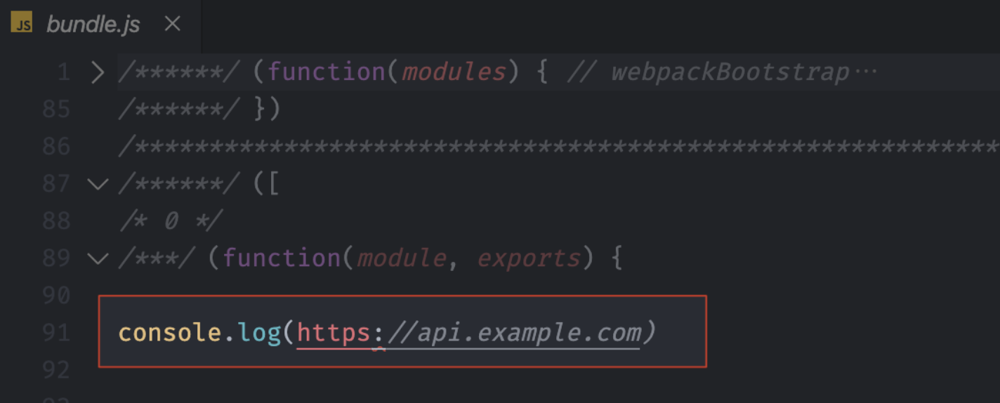
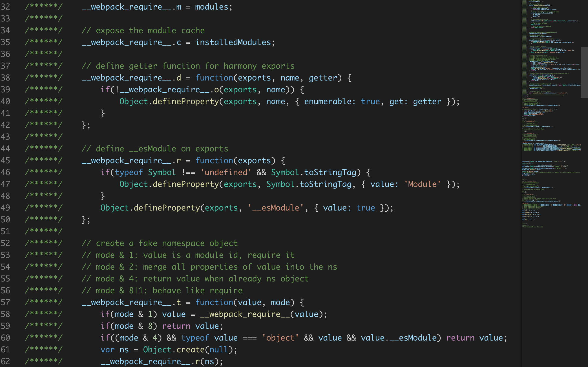

# 如何优化 Webpack 的构建速度和打包结果？

我们已经了解到的用法和特性都是为了在开发阶段能够拥有更好的开发体验。而随着这些体验的提升，一个新的问题出现在我们面前：我们的打包结果会变得越来越臃肿。<br>

这是因为在这个过程中 Webpack 为了实现这些特性，会自动往打包结果中添加一些内容。例如我们之前用到的 Source Map 和 HMR，它们都会在输出结果中添加额外代码来实现各自的功能。<br>

但是这些额外的代码对生产环境来说是冗余的。因为生产环境和开发环境有很大的差异，在生产环境中我们强调的是以更少量、更高效的代码完成业务功能，也就是注重运行效率。而开发环境中我们注重的只是开发效率。<br>

那针对这个问题，Webpack 4 推出了 mode 的用法，为我们提供了不同模式下的一些预设配置，其中生产模式下就已经包括了很多优化配置。同时 Webpack 也建议我们为不同的工作环境创建不同的配置，以便于让我们的打包结果可以适用于不同的环境。<br>

## 不同环境下的配置
我们先为不同的工作环境创建不同的 Webpack 配置。创建不同环境配置的方式主要有两种：
- 在配置文件中添加相应的判断条件，根据环境不同导出不同配置。
- 为不同环境单独添加一个配置文件，一个环境对应一个配置文件。

我们分别尝试一下通过这两种方式，为开发环境和生产环境创建不同配置。<br>

首先在配置文件中添加判断的方式。我们回到配置文件中，Webpack 配置文件还支持**导出一个函数**，然后在函数中返回所需要的配置对象。这个函数可以接收两个参数，第一个是 env，是我们通过 CLI 传递的环境名参数，第二个是 argv，是运行 CLI 过程中的所有参数。具体代码如下：
```javascript
// ./webpack.config.js
module.exports = (env, argv) => {
    return {
        // ... webpack 配置
    }
}
```
然后通过判断，再为 config 对象添加不同环境下的特殊配置。具体如下：<br>
```javascript
// ./webpack.config.js
module.exports = (env, argv) => {
    const config = {
        // ... 不同模式下的公共配置
    }
    if (env === 'development') {
        // 为 config 添加开发模式下的特殊配置
        config.mode = 'development'
        config.devtool = 'cheap-eval-module-source-map'
    } else if (env === 'production') {
        // 为 config 添加生产模式下的特殊配置
        config.mode = 'production'
        config.devtool = 'nosources-source-map'
    }
    return config
}
```
通过这种方式完成配置过后，我们打开命令行终端，这里我们再去执行 webpack 命令时就可以通过 --env 参数去指定具体的环境名称，从而实现在不同环境中使用不同的配置。<br>

## 不同环境的配置文件
通过判断环境名参数返回不同配置对象的方式只适用于中小型项目，因为一旦项目变得复杂，我们的配置也会一起变得复杂起来。所以对于大型的项目来说，还是建议使用不同环境对应不同配置文件的方式来实现。<br>

一般在这种方式下，项目中最少会有三个 webpack 的配置文件。其中两个用来分别适配开发环境和生产环境，另外一个则是公共配置。因为开发环境和生产环境的配置并不是完全不同的，所以需要一个公共文件来抽象两者相同的配置。具体配置文件结构如下：<br>
```
├── webpack.common.js ···························· 公共配置
├── webpack.dev.js ······························· 开发模式配置
└── webpack.prod.js ······························ 生产模式配置
```
首先我们在项目根目录下新建一个 webpack.common.js，在这个文件中导出不同模式下的公共配置；然后再来创建一个 webpack.dev.js 和一个 webpack.prod.js 分别定义开发和生产环境特殊的配置。<br>

在不同环境的具体配置中我们先导入公共配置对象，然后这里可以使用 Object.assign 方法把公共配置对象复制到具体环境的配置对象中，并且同时去覆盖其中的一些配置。具体如下：
```javascript
// ./webpack.common.js
module.exports = {
  // ... 公共配置
}
// ./webpack.prod.js
const common = require('./webpack.common')
module.exports = Object.assign(common, {
  // 生产模式配置
})
// ./webpack.dev.js
const common = require('./webpack.common')
module.exports = Object.assign(common, {
  // 开发模式配置
})
```
我们可以先通过 npm 安装一下 webpack-merge 模块代替Object.assign。因为assign这个方法会完全覆盖掉前一个对象中的同名属性,但是像配置中的 plugins 这种数组，我们只是希望在原有公共配置的插件基础上添加一些插件，那 Object.assign 就做不到了。<br>

## 生产模式下的优化插件
- DefinePlugin 是用来为我们代码中注入全局成员的。在 production 模式下，默认通过这个插件往代码中注入了一个 process.env.NODE_ENV。很多第三方模块都是通过这个成员去判断运行环境，从而决定是否执行例如打印日志之类的操作。

- 这个插件的构造函数接收一个对象参数，对象中的成员都可以被注入到代码中。具体代码如下：
```javascript
// ./webpack.config.js
const webpack = require('webpack')
module.exports = {
    // ... 其他配置
    plugins: [
        new webpack.DefinePlugin({
            API_BASE_URL: '"https://api.example.com"'
        })
    ]
}

// ./src/main.js
console.log(API_BASE_URL)
```
- 完成以后我们打开控制台，然后运行 webpack 打包。打包完成过后我们找到打包的结果，然后找到 main.js 对应的模块。具体结果如下：

> Tips: 定义的值传入一个字符串字面量语句。API_BASE_URL: '"https://api.example.com"'，单引号中引入双引号包裹的字符串

## Mini CSS Extract Plugin
- 对于 CSS 文件的打包，一般我们会使用 style-loader 进行处理，这种处理方式最终的打包结果就是 CSS 代码会内嵌到 JS 代码中。
- mini-css-extract-plugin 是一个可以将 CSS 代码从打包结果中提取出来的插件。
```javascript
// webpack.config.js
const MiniCssExtractPlugin = require('mini-css-extract-plugin')
module.exports = {
    module: {
        rules: [
            {
                test: /\.css$/,
                use: [
                // 'style-loader', // 将样式通过 style 标签注入
                MiniCssExtractPlugin.loader,
                    'css-loader'
                ]
            }
        ]
    },
    plugins: [
        new MiniCssExtractPlugin()
    ]
}
```
- 这样 Mini CSS Extract Plugin 在工作时就会自动提取代码中的 CSS 了。打包过后，样式就会存放在独立的文件中，直接通过 link 标签引入页面。
- 不过这里需要注意的是，如果你的 CSS 体积不是很大的话，提取到单个文件中，效果可能适得其反，因为单独的文件就需要单独请求一次。个人经验是如果 CSS 超过 200KB 才需要考虑是否提取出来，作为单独的文件。


## Optimize CSS Assets Webpack Plugin

- 使用Mini CSS Extract Plugin之后，样式文件被提取到了单独的css文件中，但是不会像JS文件那样被压缩。这是因为，Webpack 内置的压缩插件仅仅是针对 JS 文件的压缩，其他资源文件的压缩都需要额外的插件。

- Webpack 官方推荐了一个 Optimize CSS Assets Webpack Plugin 插件。我们可以使用这个插件来压缩我们的样式文件。<br>

`npm i optimize-css-assets-webpack-plugin --save-dev`<br>

- 安装完成过后，我们回到配置文件中，添加对应的配置。具体代码如下：
```javascript
// ./webpack.config.js
const MiniCssExtractPlugin = require('mini-css-extract-plugin')
const OptimizeCssAssetsWebpackPlugin = require('optimize-css-assets-webpack-plugin')
module.exports = {
    mode: 'none',
    entry: {
        main: './src/index.js'
    },
    output: {
        filename: '[name].bundle.js'
    },
    module: {
        rules: [
            {
                test: /\.css$/,
                use: [
                MiniCssExtractPlugin.loader,
                'css-loader'
                ]
            }
        ]
    },
    plugins: [
        new MiniCssExtractPlugin(),
        new OptimizeCssAssetsWebpackPlugin()
    ]
}
```
- 再次打包，发现样式文件已经被压缩了
- 但是在官方文档中，我们发现，文档中的这个插件并不是配置在 plugins 数组中的，而是添加到了 optimization 对象中的 minimizer 属性中。具体如下：
```javascript
// ./webpack.config.js
const MiniCssExtractPlugin = require('mini-css-extract-plugin')
const OptimizeCssAssetsWebpackPlugin = require('optimize-css-assets-webpack-plugin')
module.exports = {
    mode: 'none',
    entry: {
        main: './src/index.js'
    },
    output: {
        filename: '[name].bundle.js'
    },
    optimization: {
        minimizer: [
            new OptimizeCssAssetsWebpackPlugin()
        ]
    },
    module: {
        rules: [
            {
                test: /\.css$/,
                use: [
                MiniCssExtractPlugin.loader,
                'css-loader'
                ]
            }
        ]
    },
    plugins: [
        new MiniCssExtractPlugin()
    ]
}
```
- 因为如果我们配置到 plugins 属性中，那么这个插件在任何情况下都会工作。而配置到 minimizer 中，就只会在 minimize 特性开启时才工作。所以 Webpack 建议像这种压缩插件，应该我们配置到 minimizer 中，便于 minimize 选项的统一控制。

- 但是这么配置也有个缺点，此时我们再次运行生产模式打包，打包完成后再来看一眼输出的 JS 文件，此时你会发现，原本可以自动压缩的 JS，现在却不能压缩了。具体 JS 的输出结果如下：


- 这是因为我们设置了 minimizer，Webpack 认为我们需要使用自定义压缩器插件，那内部的 JS 压缩器就会被覆盖掉。我们必须手动再添加回来。内置的 JS 压缩插件叫作 terser-webpack-plugin，我们回到命令行手动安装一下这个模块。
```javascript
// ./webpack.config.js
const MiniCssExtractPlugin = require('mini-css-extract-plugin')
const OptimizeCssAssetsWebpackPlugin = require('optimize-css-assets-webpack-plugin')
const TerserWebpackPlugin = require('terser-webpack-plugin')
module.exports = {
    optimization: {
        minimizer: [
            new TerserWebpackPlugin(),
            new OptimizeCssAssetsWebpackPlugin()
        ]
    },
    plugins: [
        new MiniCssExtractPlugin()
    ]
}
```
- 那这样的话，我们再次以生产模式(mode: "production")运行打包，JS 文件和 CSS 文件就都可以正常压缩了。


